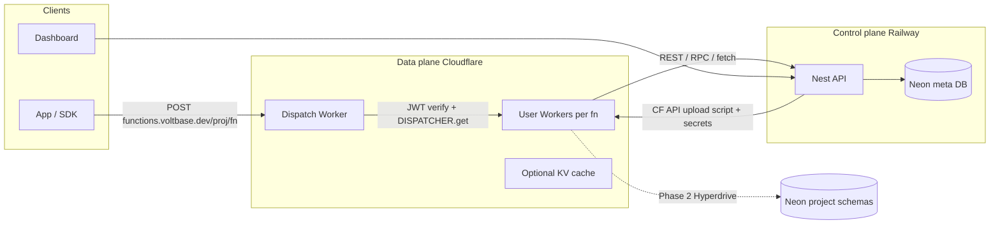

# Edge Functions (Cloudflare) — faster than Supabase

> **Status:** Deferred until Cloudflare **Workers for Platforms** (~$25/mo) is funded.  
> When the user says **edge**, **edge functions**, or **resume edge**, open this plan and start building Phase 1.  
> Cursor rule: [`.cursor/rules/edge-functions.mdc`](../../.cursor/rules/edge-functions.mdc)  
> Also mirrored: `~/.cursor/plans/edge_functions_cloudflare_ddca60f1.plan.md`

## Product stance

**Supabase parity in DX, Cloudflare for speed.**

| | Supabase Edge | Voltbase Edge (this plan) |
|--|---------------|---------------------------|
| Runtime | Deno on Deno Deploy (~35 regions) | **V8 isolates on Cloudflare Workers** (300+ PoPs) |
| Cold start | ~50–120ms | **~0–5ms** |
| Multi-tenant | Their edge runtime | **Workers for Platforms** (isolated user Workers) |
| Invoke path | Their edge gateway | **CF dispatch Worker** (no Railway hop) |
| Control plane | Their API + dashboard | **Nest on Railway** (CRUD, deploy, secrets) |
| Client | `supabase.functions.invoke` | `voltbase.functions.invoke` |

**Honest trade-off:** user code is **Workers TypeScript** (`export default { fetch }`), not Deno `Deno.serve`. Docs + templates make this feel first-class; `nodejs_compat` covers most npm. Speed and global footprint beat Supabase; runtime is different by design.

**Cost:** Cloudflare Workers for Platforms **$25/mo** floor (+ usage overages). Free Cloudflare account is not enough. Marketing “Start building for free” = free signup only.

## Architecture



**Why invoke never goes through Nest:** a Railway proxy would destroy multi-region latency. Nest only **deploys** and **manages**; Cloudflare **runs**.

### What Cloudflare Workers do

1. **Dispatch Worker** (`voltbase-functions-gateway`)  
   - Public host: `https://functions.voltbase.dev/{projectSlug}/{functionName}` (path routing; subdomain later).  
   - Validates `Authorization: Bearer` project JWT with `PROJECT_JWT_SECRET` (same claims as [`ProjectKeyGuard`](../../apps/api/src/project-api/project-key.guard.ts): `projectId`, `role`, `v`).  
   - Optionally forwards `X-User-Jwt` for RLS when the function calls Voltbase REST.  
   - Resolves script: `env.DISPATCHER.get(`${projectId}__${functionName}`)`.  
   - Returns 404 if missing; applies timeout/size limits.

2. **User Workers** (one per function, inside one dispatch namespace e.g. `voltbase-fns-prod`)  
   - Isolated untrusted code (WfP default).  
   - Deployed via CF API:  
     `PUT /accounts/:id/workers/dispatch/namespaces/:ns/scripts/:scriptName`  
   - Bindings injected on every deploy:  
     `VOLTBASE_URL`, `VOLTBASE_ANON_KEY`, `VOLTBASE_SERVICE_ROLE_KEY`, `VOLTBASE_SCHEMA`, plus user secrets.  
   - Handler shape:

```ts
export default {
  async fetch(request: Request, env: Env): Promise<Response> {
    // use env.VOLTBASE_* or fetch(env.VOLTBASE_URL + '/rest/...')
    return Response.json({ ok: true });
  },
};
```

3. **Outbound Worker** (phase 2) — egress allowlist (block SSRF to internal nets).  
4. **Hyperdrive → Neon** (phase 2) — for functions that need raw SQL with pooled edge→DB paths; v1 prefers Voltbase REST/RPC so RLS stays consistent.  
5. **Observability** — CF Workers logs/tail for invoke; Nest stores deploy metadata.

### What Nest (Railway) does

Control plane only:

- Tables: `edge_functions` (projectId, name, source, status, cfScriptName, version, updatedAt), `edge_function_secrets` (encrypted).  
- Dashboard JWT routes under `orgs/:slug/projects/:projectSlug/functions`.  
- Deploy pipeline: validate name → esbuild/bundle optional → upload to WfP → mark `ACTIVE`.  
- Secrets CRUD → re-bind on next deploy (or immediate CF secrets update).  
- Does **not** execute user code.

### SDK

In [`packages/voltbase-js`](../../packages/voltbase-js/src/client.ts):

```ts
await voltbase.functions.invoke('hello-world', {
  body: { name: 'Voltbase' },
  headers?: Record<string, string>,
});
// POST `${functionsBaseUrl}/${projectSlug}/${name}`
// Authorization: Bearer <apiKey>
```

`functionsBaseUrl` derived from `projectUrl` or `VOLTBASE_FUNCTIONS_URL` (e.g. `https://functions.voltbase.dev`).

## Supabase DX mapping

| Supabase | Voltbase |
|----------|----------|
| Dashboard Edge Functions editor | Monaco editor + Deploy |
| `supabase functions deploy` | Dashboard Deploy (+ later CLI) |
| `functions.invoke` | `voltbase.functions.invoke` |
| Secrets | Project Edge Function secrets |
| JWT gate on invoke | Dispatch Worker verifies project key |
| `Deno.env.get('SUPABASE_*')` | `env.VOLTBASE_*` bindings |
| Local `functions serve` | Phase 2: `wrangler`/Miniflare against staging namespace |

## Implementation phases

### Phase 1 — ship (this build)

- Cloudflare account: **Workers for Platforms** (~$25/mo) namespace `voltbase-fns-prod`; env vars on Nest: `CF_ACCOUNT_ID`, `CF_API_TOKEN`, `CF_DISPATCH_NAMESPACE`, `FUNCTIONS_PUBLIC_URL`.  
- Repo: `apps/functions-gateway/` — Wrangler project for the dispatch Worker.  
- Nest: `EdgeFunctionsModule` — list/get/create/update/delete/deploy/secrets; Drizzle schemas + migration.  
- Dashboard: sidebar **Edge Functions**, list + editor + deploy + secrets + “Test invoke”.  
- SDK `functions.invoke` + README.  
- Docs: `/docs/functions` (runtime differences, hello-world, secrets, auth).  
- Hello-world template bundled in dashboard.

### Phase 2 — “better” depth

- Log viewer (CF Tail / Logpush → dashboard).  
- Hyperdrive binding option for power users.  
- Outbound Worker egress policies.  
- Cron triggers (CF Cron → dispatch).  
- Local serve docs (`wrangler` + staging namespace).

### Phase 3 — polish

- `{projectSlug}.functions.voltbase.dev` custom hostnames.  
- DB webhooks → function invoke.  
- Thin CLI `voltbase functions deploy`.

## Explicit non-goals (phase 1)

- Deno/`Deno.serve` compatibility layer.  
- Executing functions inside Nest/Railway.  
- Proxying invoke through the Nest API (latency killer).  
- Per-customer Cloudflare accounts.

## Defaults locked

| Decision | Choice |
|----------|--------|
| Compute | Cloudflare **Workers for Platforms** |
| Invoke | Global **dispatch Worker** (bypass Nest) |
| Auth | Same project JWT as REST (`anon` / `service_role`) |
| Source of truth | Neon meta tables + CF script upload |
| Editor | Dashboard Monaco (CLI later) |
| DB from functions (v1) | Voltbase REST/RPC via injected keys |
| Naming | CF script = `{projectId}__{functionName}` |

## Infra prerequisites (ops)

- Cloudflare **Workers for Platforms** Paid (~$25/mo).  
- DNS: `functions.voltbase.dev` → Workers custom domain.  
- Nest secrets for CF API token (scoped: Workers Scripts, Workers for Platforms).  
- Document that without CF credentials, dashboard shows setup guidance (local can mock deploy in dev only if needed).

## Verify

- Deploy hello-world from dashboard → ACTIVE in CF namespace.  
- `curl` + `voltbase.functions.invoke` from multiple regions feel fast (no Railway hop).  
- Invalid/missing JWT → 401 from dispatch.  
- Secret appears as `env.MY_SECRET` after redeploy.  
- Typecheck api/web/voltbase-js + gateway `wrangler deploy` dry-run.
